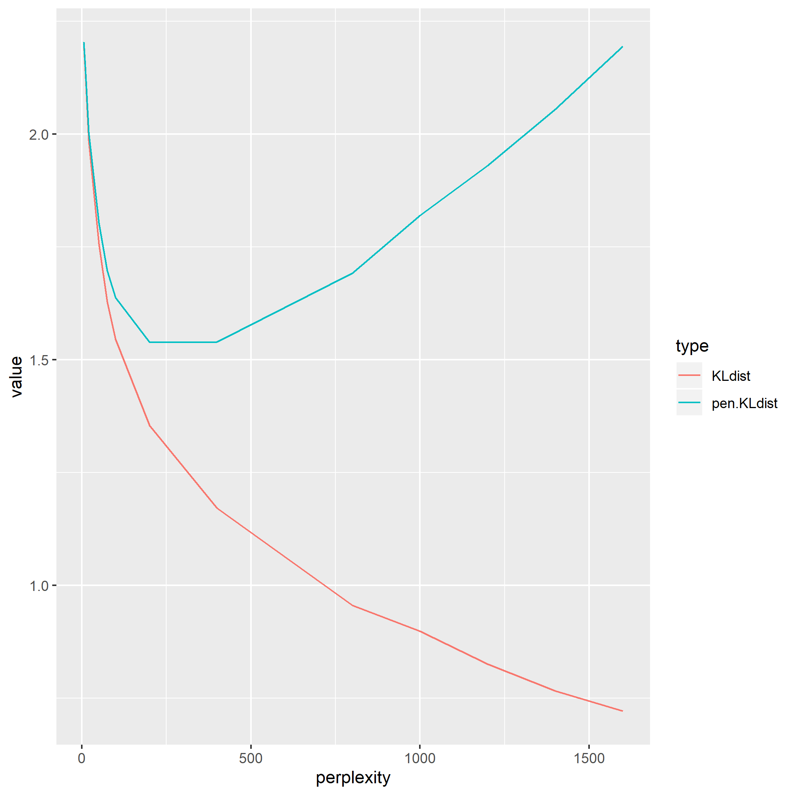

```{r setup, include=FALSE}
knitr::opts_chunk$set(
  collapse = TRUE,
  comment = "#>",
  message = FALSE
)
```


# Overview

Reporoducible check for Cao and Wang (2017) "Automatic Selection of t-SNE Perplexity".

## reference

JMLR: Workshop and Conference Proceedings 1:1–7, 2017 ICML 2017 AutoML Workshop
"Automatic Selection of t-SNE Perplexity" 
[https://arxiv.org/abs/1708.03229](https://arxiv.org/abs/1708.03229)

Using MNIST (test set) as csv fromat was downloaded from :

https://github.com/pjreddie/mnist-csv-png

```{r}
set.seed(1)

require(tidyverse)
require(Rtsne)
load("../data/mnist.rda")
str(mnist, 0)
df.u <- mnist[, -1]

n <- NROW(df.u)
df.u %>% str(0)

```

```{r, eval = FALSE}
KL <- NULL
res <- list(NULL)
max.p <- (NROW(df.u) -1) / 3
try.p <- c(5, 10,20,50,75,100,200,400,800, 1000, 1200, 1400, 1600)
for(i in 1:length(try.p)) {
  p <- try.p[i]
  ri <- Rtsne::Rtsne(unique(df.u), perplexity = p)
  kld <- last(ri$itercosts)
  tmp <- c(
    perplexity = p, 
    KLdist     = kld,
    pen.KLdist = kld + log(n) * p/n)
  
  KL <- rbind(KL, tmp)
  cat(tmp, "\n")
  res[[i]] <- data.frame(perp = p, Y1 = ri$Y[,1], Y2 = ri$Y[,2], label = mnist[,1])
}
KL <- data.frame(KL)

saveRDS(list(KL = KL, iter = res), "./KLD_mnist.Rds")
```
```{r}
rdsobj <- readRDS("./KLD_mnist.Rds")
KL <- rdsobj$KL
res <- rdsobj$iter

ggp.pkl <- KL %>% 
  gather(key = "type", value = "value", -perplexity) %>% 
  ggplot(aes(x = perplexity, y = value, colour = type)) +
  geom_line()
    
ggsave(filename = "kl_vs_perp.png")
# res %>% str

```




## plot animation

```{r}
# i=1
# 
# this.p = try.p[i]
# ggp.pkl.this <- ggp.pkl +
#   geom_vline(xintercept = try.p[1], color = "blue") +
#   labs(title = paste("Perplexty = ", p)) +
#   theme(legend.title=element_blank(),
#         legend.position = "bottom")
# 
# # ggp.pkl.this
# 
# ggp.map.this <- res[[i]] %>% 
#   ggplot(aes(x = Y1, y = Y2, color = factor(label))) +
#   geom_point(alpha = 0.3) +
#   labs(title = "") +
# theme(legend.position = "none")
# # ggp.map.this
# ggp.sw <- list(ggp.pkl.this, ggp.map.this)
# 
# gridExtra::grid.arrange(ggp.pkl.this, ggp.map.this, ncol = 2)

```


```{r}
library(animation)
ani.options(convert='C:/ImageMagick-7.0.8-Q16/convert.exe') 

saveGIF(
  {
    for(i in 1:length(try.p)){
      
      this.p = try.p[i]
      ggp.pkl.this <- ggp.pkl +
        geom_vline(xintercept = this.p, color = "blue") +
        labs(title = paste("Perplexty = ", this.p)) +
        theme(legend.title=element_blank(),
              legend.position = "bottom")
      
      ggp.map.this <- res[[i]] %>% 
        ggplot(aes(x = Y1, y = Y2, color = factor(label))) +
        geom_point(alpha = 0.3) +
        labs(title = "") +
        theme(legend.position = "none")
      # 
      # ggp.sw <- list(ggp.pkl.this, ggp.map.this)
      # 
      gridExtra::grid.arrange(ggp.pkl.this, ggp.map.this, ncol = 2)
      
    }
  }, 
  movie.name = "./perp-tsne.gif", 
  interval = 1.5, ani.width=960, ani.height=480)

```

